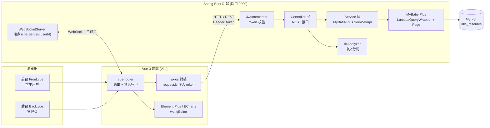

# UniResTrade · 高校闲置资源交易平台

UniResTrade 是一个面向高校学生的闲置资源交易平台。学生在校园内产生的闲置教材、数码产品、生活用品等资源，往往因为缺少一个可信的发布与撮合渠道而被闲置或直接丢弃；本平台把"发布 — 检索 — 沟通 — 下单 — 线下交易"这条链路完整搬到线上，并以线下当面交易替代线上支付，规避了校园场景中的资金与信用风险。

项目采用前后端分离架构：后端为 Spring Boot 单体应用，提供 REST 接口与 WebSocket 实时通信；前端为 Vue 3 单页应用，分为面向学生的前台与面向管理员的运营后台。业务上覆盖 11 张数据表、85 个 REST 接口，前台 13 个、后台 14 个功能页面。

> 本项目为软件工程专业本科毕业设计作品，用于学习与求职作品展示。

---

## 一、技术栈

### 后端

| 技术 | 版本 | 用途 |
| --- | --- | --- |
| Spring Boot | 3.5.0 | 应用框架、依赖注入、Web MVC |
| Java | 24 | 开发语言 |
| MyBatis-Plus | 3.5.9 | ORM、`LambdaQueryWrapper` 条件构造、分页插件 |
| MySQL | 8.x | 关系型数据库 |
| java-jwt | 4.4.0 | JWT 令牌签发与校验 |
| spring-boot-starter-websocket | — | 基于 Jakarta WebSocket 的实时聊天 |
| Lucene | 8.11.1 | 分词与词频统计（后台关键词云） |
| ik-analyzer | 8.5.0 | Lucene 中文分词器 |
| Hutool | 5.8.21 | 日期、JSON、文件、字符串等工具类 |
| Lombok | 1.18.38 | 实体类样板代码消除 |

### 前端

| 技术 | 版本 | 用途 |
| --- | --- | --- |
| Vue | 3.5 | 前端框架（组合式 API，`<script setup>`） |
| Vite | 6.2 | 构建工具与开发服务器 |
| Element Plus | 2.9 | UI 组件库 |
| ECharts | 5.6 | 后台数据可视化 |
| echarts-wordcloud | 2 | 后台关键词云图 |
| wangEditor | 5.1 | 富文本编辑器（文章正文） |
| axios | 1.9 | HTTP 请求封装 |
| vue-router | 4.5 | 前端路由与登录守卫 |
| Sass | 1.87 | 样式预处理 |

### 数据库

| 项 | 值 |
| --- | --- |
| 数据库名 | `idle_resource` |
| 字符集 | `utf8mb4` |
| 存储引擎 | InnoDB |
| 表数量 | 11 |

### 工程目录结构

```text
UniResTrade/
├── src/main/java/com/example/springboot/
│   ├── common/          # WebSocketServer、Result、Constants
│   ├── config/          # 拦截器注册、CORS、MyBatis-Plus、WebSocket、IK 分词器
│   ├── controller/      # 13 个 REST 控制器
│   ├── entity/          # 实体类（Account 为 User/Admin 的父类）
│   ├── exception/       # 全局异常处理与业务异常
│   ├── mapper/          # MyBatis-Plus Mapper 接口
│   ├── service/ + service/impl/   # 业务接口与实现
│   └── utils/           # TokenUtils（JWT 签发与解析）
├── src/main/resources/
│   └── application-example.yaml   # 配置模板（真实配置已被 git 忽略）
├── vue/                 # 前端 Vue 3 工程
│   ├── config/          # 项目名与接口服务器地址
│   └── src/
│       ├── views/front/ # 前台页面（13 个）
│       ├── views/back/  # 后台页面（14 个）
│       ├── router/      # 路由与登录守卫
│       └── utils/       # axios 封装、token 注入、401 跳转
├── sql/
│   └── init.sql         # 建库建表 + 脱敏演示数据
└── test/jmeter/         # JMeter 并发压测脚本与账号数据
```

---

## 二、功能模块

### 前台（面向学生用户）

| 模块 | 页面文件 | 说明 |
| --- | --- | --- |
| 首页 | `front/Home.vue` | 轮播图、系统公告、校园资讯列表 |
| 闲置资源列表 | `front/Goods.vue` | 分类筛选 + 关键词检索 + 分页 |
| 闲置资源详情 | `front/GoodsDetail.vue` | 图文详情、收藏、进入沟通或下单 |
| 发布闲置 | `front/Release.vue` | 图片上传、成色、价格、分类填写 |
| 我的物品 | `front/MyGoods.vue` | 管理自己发布的资源 |
| 确认下单 | `front/Confirm.vue` | 选择线下交易地点、生成订单 |
| 我的订单 | `front/Orders.vue` | 区分"我卖出的 / 我买到的"，按状态筛选 |
| 我的收藏 | `front/Collect.vue` | 收藏列表与取消收藏 |
| 在线沟通 | `front/Chat.vue` | WebSocket 实时聊天、在线状态、未读计数 |
| 我的地址 | `front/Address.vue` | 维护线下交易地点 |
| 个人信息 | `front/Person.vue` | 昵称、头像、邮箱、手机号 |
| 修改密码 | `front/Password.vue` | 校验原密码后更新 |
| 校园资讯详情 | `front/ArticleDetail.vue` | 富文本文章正文 |

### 后台（面向管理员）

| 模块 | 页面文件 | 说明 |
| --- | --- | --- |
| 后台首页 | `back/Home.vue` | 业务概览 + 分类占比图 + 关键词云 |
| 用户管理 | `back/User.vue` | 用户增删改查、批量生成学生账号 |
| 管理员管理 | `back/Admin.vue` | 管理员账号维护 |
| 闲置资源管理 | `back/Goods.vue` | 全平台资源审核与上下架 |
| 资源分类管理 | `back/Category.vue` | 分类维护 |
| 交易订单管理 | `back/Orders.vue` | 全平台订单查询 |
| 聊天管理 | `back/Chat.vue` | 聊天记录查询 |
| 收藏管理 | `back/Collect.vue` | 收藏关系查询 |
| 交易地点管理 | `back/Address.vue` | 线下交易地点维护 |
| 轮播图管理 | `back/Banner.vue` | 首页轮播图维护 |
| 公告管理 | `back/Notice.vue` | 系统公告发布 |
| 文章管理 | `back/Article.vue` | 校园资讯发布（富文本） |
| 个人信息 | `back/AdminPerson.vue` | 管理员资料 |
| 修改密码 | `back/Password.vue` | 管理员密码修改 |

### 通用页面

`Login.vue`（登录）、`Register.vue`（注册）、`404.vue`（错误页）。

---

## 三、系统架构



**一次典型请求的链路**：浏览器发起请求 → axios 请求拦截器从 `localStorage` 取出 `account.token` 写入 `token` 请求头 → `JwtInterceptor` 校验令牌并解析出 `userId` 与 `role` → Controller 通过 `TokenUtils.getCurrentUser()` 取当前登录人 → Service 层用 `LambdaQueryWrapper` 构造条件、`Page` 承载分页 → MyBatis-Plus 生成 SQL 交由 MySQL 执行 → axios 响应拦截器统一处理结果，遇到 `code === '401'` 时提示并跳转登录页。

**实时消息链路**：浏览器与 `/chatServer/{userId}` 建立 WebSocket 长连接 → 服务端在内存中维护在线会话表 → 消息由服务端中转给接收方，同时前端另发一次 REST 请求把消息落库。

---

## 四、核心实现说明

### 4.1 WebSocket 实时聊天

**连接注册**（`common/WebSocketServer.java`）

端点声明为 `@ServerEndpoint(value = "/chatServer/{userId}")`，并把 `userId` 作为路径参数直接带在连接地址上。`config/WebSocketConfig.java` 注册 `ServerEndpointExporter`，让 Spring 扫描并发布所有 `@ServerEndpoint` 声明的端点。

在线会话集中存放在一个静态并发容器里，key 是用户 ID，value 是 WebSocket 会话：

```java
private static final Map<Integer, Session> sessionMap = new ConcurrentHashMap<>();
```

`@OnOpen` 执行 `sessionMap.put(userId, session)`，`@OnClose` 执行 `sessionMap.remove(userId, session)`。这里的两参数 `remove` 是有意为之：用户可能在多个标签页建立连接，`put` 会让后建立的会话覆盖先前的，而两参数 `remove` 只在当前会话确实是自己时才移除，避免误删同一用户的其它连接。连接建立与断开后都会调用 `broadcastSession()`。

**消息中转**

`@OnMessage` 解析客户端发来的 JSON，取出 `text`、`type`、`time`、`fromUserId`、`toUserId`，再从 `sessionMap` 中查找接收方的会话，找到就补上 `messageType: "chat"` 标记后转发：

```java
Session toSession = sessionMap.get(toUserId);
if (toSession != null) {
    JSONObject jsonObject = new JSONObject();
    jsonObject.set("text", text);
    // ...
    jsonObject.set("messageType", "chat");
    sendMessage(toSession, jsonObject.toString());
}
```

也就是说消息走的是**服务端中转**而非客户端直连：发送方只与服务器保持一条连接，接收方的会话由服务器查找并投递，发送方无需知道接收方的网络地址。接收方不在线时服务端仅打印日志、不投递，消息的可靠到达由数据库历史记录兜底。

**在线状态广播**

`broadcastSession()` 把当前所有在线用户 ID 推给**每一个**在线连接：

```java
private void broadcastSession() {
    JSONObject jsonObject = new JSONObject();
    jsonObject.set("userIds", sessionMap.keySet());
    jsonObject.set("messageType", "broadcast");
    for (Session session : sessionMap.values()) {
        sendMessage(session, jsonObject.toString());
    }
}
```

前端 `front/Chat.vue` 收到 `messageType === 'broadcast'` 的消息后，用这份全量 ID 列表刷新每个联系人的在线状态：

```js
if (data.messageType === 'broadcast') {
  userIds.value = data.userIds
  users.value.forEach(item => {
    item.online = userIds.value.includes(item.id)
  })
}
```

由于 `@OnOpen` 和 `@OnClose` 都会触发广播，任一用户上下线都会让所有客户端在同一个心跳节奏上刷新状态，而 `/chat/user` 接口返回的 `online` 字段本身恒为 `false`，实际在线状态完全由这条广播消息决定。

**消息持久化与未读处理**

WebSocketServer 只做转发，不写数据库；服务端也没有把 `IChatService` 注入进来。持久化由前端在发送消息后**并行再发一次 REST 请求**完成（`front/Chat.vue`）：

```js
socket.send(JSON.stringify(message))   // 实时投递
createMessage(message)                 // 本地立即渲染
saveMessage(message)                   // POST /chat 落库
```

`saveMessage` 调用 `POST /chat`，最终落到 `ChatController.save()` 的 `chatService.saveOrUpdate(chat)`。

未读消息的处理分两处：

- `GET /chat/user` 拉取联系人列表时，把与当前用户相关的全部消息一次取出，用 `Collectors.groupingBy` 统计「发送方是对方、接收方是自己、且 `isRead == false`」的消息条数，作为每个联系人的未读数一并返回；
- `GET /chat/clear` 在打开某个会话时被调用，把对方发给自己的未读消息批量置为已读：

```java
LambdaQueryWrapper<Chat> queryWrapper = new LambdaQueryWrapper<>();
queryWrapper.eq(Chat::getFromUserId, toUserId);
queryWrapper.eq(Chat::getToUserId, fromUserId);
queryWrapper.eq(Chat::getIsRead, false);
List<Chat> list = chatService.list(queryWrapper);
list.stream().forEach(item -> item.setIsRead(true));
chatService.updateBatchById(list);
```

因此未读计数在每次打开会话（`loadMessage`）以及每次自己发出消息（`saveMessage`）之后都会被清零并同步到数据库。需要注意的是，`clear()` 只在 `loadMessage` 与 `saveMessage` 之后触发，而 `loadMessage` 又仅在切换联系人时调用，所以当用户停留在当前会话、对方连续发来多条消息时，界面上的未读数不一定会立即回落。

### 4.2 JWT 登录鉴权

**令牌生成**（`utils/TokenUtils.java`）

```java
public static String createToken(String data, String sign) {
    return JWT.create().withAudience(data)                            // 载荷：userId-role
            .withExpiresAt(DateUtil.offsetHour(new Date(), 2))        // 2 小时后过期
            .sign(Algorithm.HMAC256(sign));                           // 以密码作为密钥签名
}
```

登录成功后由 `UserServiceImpl` / `AdminServiceImpl` 调用，载荷写成 `"用户ID-角色"` 的形式（例如 `1-ROLE_USER`），签名算法为 HMAC256，密钥取当前用户的密码字段，有效期 2 小时。返回给前端的 `Account` 对象会把密码置空，只回传 token、角色和基础资料。

**拦截与校验**（`config/interceptor/JwtInterceptor.java`）

`config/InterceptorConfig.java` 把拦截器注册到 `/**`：

```java
registry.addInterceptor(jwtInterceptor())
        .addPathPatterns("/**")
        .excludePathPatterns("/web/login", "/web/register")
        .excludePathPatterns("/web/upload", "/web/download/**");
```

`preHandle` 的执行顺序是：

1. 从请求头 `token` 取值，取不到则回退到查询参数 `token`；
2. 若目标方法带 `@AuthAccess` 注解，直接放行；
3. token 为空则抛出 `401 无token，请重新登录`；
4. `JWT.decode(token)` 取出载荷，按 `-` 拆出 `userId` 与 `role`，再依据角色分别查 `sys_user` 或 `sys_admin`；
5. 查不到用户则抛出 `401 用户不存在，请重新登录`；
6. 用查出来的用户密码作为密钥重建 `JWTVerifier` 完成签名与过期时间校验，失败则抛出 `401 token验证失败，请重新登录`。

第 6 步是关键：token 的签名密钥不是全局常量，而是**登录用户的密码**。这意味着密码一旦变更，此前签发的所有令牌会立即失效，等同于一次全端强制下线。`TokenUtils.getCurrentUser()` 则复用同一套解码逻辑，供各 Controller 获取当前登录人。

**`AuthAccess` 注解机制**（`config/interceptor/AuthAccess.java`）

```java
@Target(ElementType.METHOD)
@Retention(RetentionPolicy.RUNTIME)
@Documented
public @interface AuthAccess {
}
```

这是一个运行期可见、可标注在方法上的空注解。`JwtInterceptor` 通过 `((HandlerMethod) handler).getMethodAnnotation(AuthAccess.class)` 读取它，非空即放行，用于给单个接口开免登录白名单。当前项目中登录、注册、上传下载这几个接口是走 `InterceptorConfig` 的 `excludePathPatterns` 排除的，`@AuthAccess` 提供的是方法级、更细粒度的替代方案。

### 4.3 MyBatis-Plus 分页与条件查询

以 `controller/GoodsController.java` 的 `findPage` 为例：

```java
@GetMapping("/page")
public Result findPage(@RequestParam Integer pageNum,
                       @RequestParam Integer pageSize,
                       @RequestParam(defaultValue = "") String keyword) {

    LambdaQueryWrapper<Goods> queryWrapper = new LambdaQueryWrapper<>();
    queryWrapper.orderByDesc(Goods::getId);

    if (StrUtil.isNotBlank(keyword)) {
        queryWrapper.like(Goods::getName, keyword);
    }

    return Result.success(goodsService.page(new Page<>(pageNum, pageSize), queryWrapper));
}
```

几点说明：

- **`LambdaQueryWrapper`** 用方法引用（`Goods::getId`）替代字符串字段名，编译期即可校验字段是否存在，避免手写列名写错只在运行期暴露；
- **条件可选拼装**，只有 `keyword` 非空时才追加 `like` 条件，天然支持"不传参数则不过滤"的语义；
- **`Page`** 承载分页参数并返回 `records / total / current / size`，底层由 `config/MybatisPlusConfig.java` 注册的 `PaginationInnerInterceptor` 改写 SQL 并额外执行一次 count 查询；
- 前台列表 `findFrontPage` 在此基础上多加了 `cateId != 0` 的分类过滤和 `status = '已上架'` 的状态过滤，后者用 `eq` 无条件拼接，保证前台永远看不到已售出的资源：

```java
wrapper.like(StrUtil.isNotEmpty(keyword), Goods::getName, keyword);
wrapper.eq(cateId != 0, Goods::getCateId, cateId);
wrapper.eq(Goods::getStatus, "已上架");
```

注意 `cateId != 0` 作为 `eq` 的第一个布尔参数：这是 MyBatis-Plus 的条件式重载，`condition` 为 `false` 时该条件不会拼进 SQL，比手写 `if` 更简洁。

### 4.4 其他实现要点

- **Dashboard 分类占比**：`EchartsController.count()` 用 `Collectors.groupingBy(Goods::getCateId, Collectors.counting())` 一次性聚合出各分类的资源数，再与 `category` 表左对齐成 ECharts 需要的 `{name, value}` 数组。
- **关键词云**：`EchartsController.countName()` 用注入的 `IKAnalyzer` 对所有商品名称分词，经过「滤掉单字、纯数字、字母数字混合型号、停用词」四层规则清洗后按词频排序，取前 40 个词交给 `echarts-wordcloud` 渲染。这是项目里真正用上 Lucene 与 ik-analyzer 的地方。
- **统一响应与全局异常**：所有接口统一返回 `Result`，业务异常抛 `ServiceException` 并由 `GlobalExceptionHandler` 转换为带错误码的响应；错误码集中在 `common/Constants.java`（200 成功 / 400 参数错误 / 401 未授权 / 500 系统错误 / 605 业务异常）。
- **订单状态机**：`OrdersController` 通过 `/orders/pay/{id}`、`/shipment/{id}`、`/receipt/{id}`、`/cancel/{id}` 驱动"待支付 → 待发货 → 待收货 → 交易完成"以及"交易关闭"的流转；下单时会把商品名称、图片、价格与交易地点**快照**进订单表，之后商品被修改或删除都不影响历史订单的展示。

### 4.5 接口并发压测（JMeter）

`test/jmeter/` 下提供了一份可直接运行的 JMeter 测试计划 `并发测试.jmx`，用于在真实调用链下验证接口的功能可用性与响应表现，而不是只靠手工点击。

**压测配置**

| 项 | 值 |
| --- | --- |
| 并发线程数 | 100 |
| Ramp-up | 5 秒 |
| 循环次数 | 每线程 3 次 |
| 每轮请求数 | 3 个（登录 + 商品列表 + 资讯列表） |
| 请求总量 | 100 线程 × 3 轮 × 3 个 ≈ 900 次 |

**执行链路**：先 `POST /web/login` 登录，用 **JSON 后置处理器**从响应中提取 `$.data.token`，再通过 HTTP 信息头管理器把 token 注入后续的 `GET /goods/front/page`（商品列表）与 `GET /article/page`（资讯列表）请求，最后用**响应断言**校验登录接口 `code=200`。这构成了「一次登录 → 携带凭证访问业务接口」的真实调用链，而不是对单个接口做孤立打点。

> **⚠️ 关于"100 线程"的实际含义**：线程组配置是 100 线程 / ramp-up 5 秒，但结果文件中的 `allThreads`（实际并发线程数）**峰值只有个位数**。原因是三个接口响应都在 1–68 ms 量级，每个线程 3 轮循环在几十毫秒内即执行完毕并退出，而线程是分 5 秒逐步启动的——**线程尚未爬升到位，先启动的线程已经结束了**。
>
> 因此本次压测的定位是**接口在真实调用链下的功能可用性验证**（900 次请求零失败），**不能代表 100 用户并发下的性能表现**。若要测出真实的高并发能力，应把 ramp-up 拉长到 30–60 秒、或用 `Synchronizing Timer` 让请求真正同时发出，并配合更长的持续时长。

**运行方式**

```bash
# 默认使用演示账号（见 sql/init.sql：2021001 / 123456）
jmeter -n -t test/jmeter/并发测试.jmx -l test/jmeter/result.jtl

# 换用其他账号时通过属性覆盖，无需改动 .jmx
jmeter -n -t test/jmeter/并发测试.jmx \
  -Jjmeter.login.username=你的账号 \
  -Jjmeter.login.password=你的密码 \
  -l test/jmeter/result.jtl

# 生成 HTML 报告
jmeter -g test/jmeter/result.jtl -o test/jmeter/report
```

> **登录凭证已外置**：`.jmx` 中的账号密码通过 `${__P(jmeter.login.username,2021001)}` 形式读取 JMeter 属性，默认值是 `sql/init.sql` 中的演示账号，仓库内不含任何真实用户凭据。

**实测结果**（单机开发环境，应用与 MySQL 同机；数据取自 `test/jmeter/report/statistics.json`）

| 指标 | 结果 |
| --- | --- |
| 请求总量 | 900 |
| 成功 / 失败 | 900 / 0 |
| 错误率 | **0.00%** |
| 平均响应时间 | **9.51 ms** |
| 中位数响应时间 | 6 ms |
| 最小 / 最大响应时间 | 1 ms / 68 ms |
| **90% 响应时间（TP90）** | **40 ms** |
| 95% 响应时间 | 53.97 ms |
| 总耗时 | 4.98 秒 |
| **吞吐量** | **180.7 请求/秒** |
| 接收 / 发送速率 | 930.4 / 62.3 KB/s |

**按接口拆分**

| 接口 | 样本数 | 平均 | 中位数 | 最大 | 吞吐量 |
| --- | --- | --- | --- | --- | --- |
| `POST /web/login` | 300 | 5.55 ms | 3 ms | 56 ms | 60.4/s |
| `GET /goods/front/page` | 300 | 11.39 ms | 7 ms | 49 ms | 60.7/s |
| `GET /article/page` | 300 | 11.59 ms | 7 ms | 68 ms | 60.9/s |

登录接口（含密码校验与 JWT 签发）平均 5.55 ms，是最快的；两个列表接口约 11 ms，明显更重——两者都要走 `LambdaQueryWrapper` 拼接 + 分页查询 + JSON 序列化，商品列表单次返回约 8.4 KB，是响应体积最大的一个。

**重新生成报告**（基于已保存的结果文件，无需重新压测）：

```bash
jmeter -g test/jmeter/test.jtl -o test/jmeter/report
```

打开 `test/jmeter/report/index.html` 可查看完整图表；原始统计值在 `test/jmeter/report/statistics.json`。

**关于 `test/jmeter/test.csv`**：这是为登录接口做参数化准备的账号数据文件。当前 `.jmx` **尚未配置 CSV Data Set Config**，因此运行时不会读取该文件；如需在此基础上改成多账号并发，在登录请求前加一个 CSV Data Set Config，文件名指向 `test/jmeter/test.csv`，变量名设为 `username,password`，再把请求体改为 `${username}` / `${password}` 即可。

---

## 五、数据库设计

表名与 Java 实体类上的 `@TableName` 注解严格对应。其中 `User` 与 `Admin` 显式声明为 `sys_user` 与 `sys_admin`，而非 MyBatis-Plus 默认推断出的 `user` / `admin`。

| 表名 | 对应实体 | 用途 | 主要关联 |
| --- | --- | --- | --- |
| `sys_user` | `User` | 普通用户（学生）账号与资料 | — |
| `sys_admin` | `Admin` | 管理员账号与资料 | — |
| `goods` | `Goods` | 闲置资源（商品） | `cate_id` → `category.id`，`user_id` → `sys_user.id` |
| `orders` | `Orders` | 交易订单 | `item_id` → `goods.id`，`from_id`/`to_id` → `sys_user.id` |
| `chat` | `Chat` | 聊天消息与已读状态 | `from_user_id`/`to_user_id` → `sys_user.id` |
| `collect` | `Collect` | 商品收藏关系 | `user_id` → `sys_user.id`，`item_id` → `goods.id` |
| `category` | `Category` | 闲置资源分类 | — |
| `address` | `Address` | 线下交易地点 | — |
| `banner` | `Banner` | 首页轮播图 | — |
| `article` | `Article` | 校园资讯文章（富文本） | — |
| `notice` | `Notice` | 系统公告 | — |

两点设计说明：

1. **`User` / `Admin` 与 `Account` 的继承关系**。`Account` 是父类，承载 `id / username / password / nickname / avatarUrl`，以及三个标了 `@TableField(exist = false)` 的非持久化字段 `role / newPassword / token`；`User` 与 `Admin` 继承它并各自补充 `email`、`phone`。建表时父类字段已**展开为实际列**，`exist = false` 的字段不落库。
2. **不设外键约束**。以上关联关系仅在注释中标注，实际未添加 `FOREIGN KEY`。这样做的直接好处是演示数据与业务写入不受插入顺序限制、批量删除也不会被级联约束阻塞；代价是引用完整性需要应用层自行保证。

字段类型上，除 `goods.info` 与 `article.content` 用 `TEXT` / `LONGTEXT` 外，其余字符字段一律沿用项目实际使用的 `VARCHAR(255)`；`chat.time`、`orders.time`、`article.time`、`notice.time` 均为**字符串**存储而非 `DATETIME`，因为写入值是前端或 `DateUtil.now()` 生成的格式化字符串。`collect` 表在 `(user_id, item_id)` 上建有唯一索引，防止同一用户重复收藏同一商品。

> 完整的建库建表语句与演示数据见 [`sql/init.sql`](sql/init.sql)。该脚本可直接执行，用于从零搭建本地开发环境。

---

## 六、本地运行步骤

### 环境要求

- JDK 24
- Maven 3.9+
- Node.js 18+
- MySQL 8.x

### 第一步：初始化数据库

```bash
mysql -u root -p < sql/init.sql
```

脚本会创建 `idle_resource` 数据库、11 张表，并写入少量演示数据。演示账号如下（密码均为 `123456`）：

| 角色 | 账号 | 密码 |
| --- | --- | --- |
| 管理员 | `admin` | `123456` |
| 学生用户 | `2021001` | `123456` |
| 学生用户 | `2021002` | `123456` |

### 第二步：配置并启动后端

项目**已提供配置文件模板** `src/main/resources/application-example.yaml`。复制一份为 `application.yaml` 并填入自己的数据库信息：

```bash
cp src/main/resources/application-example.yaml src/main/resources/application.yaml
```

需要修改的部分：

```yaml
server:
  port: 9090

spring:
  datasource:
    url: jdbc:mysql://127.0.0.1:3306/idle_resource?useSSL=false&useUnicode=true&characterEncoding=UTF-8&serverTimezone=GMT%2b8&allowPublicKeyRetrieval=true
    username: root
    password: 你的数据库密码

ip: 127.0.0.1   # 文件上传后回显的下载地址所用主机名
```

也可以用环境变量覆盖，无需改动文件：`DB_HOST`、`DB_PORT`、`DB_NAME`、`DB_USERNAME`、`DB_PASSWORD`。

> 说明：仓库中**只提交模板** `application-example.yaml`，含真实密码的 `application.yaml` 已在 `.gitignore` 中排除。因此从仓库克隆下来后必须执行上面的复制步骤；如果你本地是在原有工程上继续开发、`application.yaml` 已存在，则无需覆盖，确认数据库信息正确即可。

启动：

```bash
mvn spring-boot:run
```

后端将在 `http://localhost:9090` 提供服务。

### 第三步：启动前端

```bash
cd vue
npm install
npm run dev
```

Vite 默认监听 `http://localhost:5173`。前端在 `vue/config/config.default.js` 中配置后端地址：

```js
const projectName = '高校闲置资源交易平台'
const ip = '127.0.0.1'
const port = '9090'
const serverHost = 'http://' + ip + ':' + port

export { projectName, serverHost }
```

该文件只导出了 `projectName` 与 `serverHost`，聊天页使用的 WebSocket 地址目前是直接写在 `vue/src/views/front/Chat.vue` 里的（`ws://localhost:9090/chatServer/{userId}`），若后端不在本机 9090 端口，需要一并修改。

### 第四步：访问

- 前台（学生端）：使用 `2021001 / 123456` 登录，自动进入 `/front/home`
- 后台（管理端）：使用 `admin / 123456` 登录，自动进入 `/back/home`

---

## 七、已知不足与后续优化

以下问题均为阅读当前代码后确认存在的，按优先级排列。

### 1. 在线用户集合存于单机内存，无法多实例共享

`WebSocketServer` 用静态 `ConcurrentHashMap<Integer, Session>` 保存在线会话。这个结构只存在于单个 JVM 内：

- 水平扩容到多个实例后，用户 A 连在实例 1、用户 B 连在实例 2，`sessionMap.get(toUserId)` 在实例 1 上必然取不到，消息**静默丢弃**（只打印一行"未找到 session"的日志）；
- 实例重启会清空全部在线状态，客户端需要重连才能恢复。

**优化方向**：引入 Redis 作为会话注册中心，把「userId → 实例标识」写入 Redis，消息通过 Redis Pub/Sub 广播到所有实例，由持有该连接的实例完成投递。同时把 `Session` 本身排除在跨实例共享之外，只共享路由信息。

### 2. 在线状态全量广播存在写放大

`broadcastSession()` 在每次有用户上下线时，都会把**完整**的在线用户 ID 列表推送给**所有**在线连接。设在线人数为 N，则一次上下线会产生 N 次发送，每次发送的载荷大小是 O(N)，单次事件的总体开销为 O(N²)。用户规模上升到数百人时，频繁的上下线会带来明显的网络与序列化压力。

**优化方向**：

- 增量广播——只推送"某用户上线"或"某用户下线"的单条事件，把单次开销降为 O(N)；
- 只向与该用户存在会话关系的联系人推送，而不是面向全站；
- 引入节流/批量合并，把短时间内的多次状态变更合并为一次推送；
- 在线状态改为按需查询（客户端打开联系人列表时再拉取一次），以牺牲一点实时性换取大幅降低的广播量。

### 3. `GoodsController.findOne()` 在 GET 接口中执行写操作

`controller/GoodsController.java` 的商品详情接口在返回数据前调用了 `goodsService.updateById(goods)`：

```java
@GetMapping("/{id}")
public Result findOne(@PathVariable Integer id) {
    Goods goods = goodsService.getById(id);
    goods.setIsCollected(false);
    // ... 计算当前用户是否收藏 ...
    goodsService.updateById(goods);   // ← 读接口产生写操作
    return Result.success(goods);
}
```

这里的问题有三层：

- **语义错误**：GET 应当是幂等、安全的只读接口，却在无任何业务必要的情况下修改数据库；
- **字段被覆盖**：`goods` 是直接查出来的实体，`isCollected` 标了 `@TableField(exist = false)` 不会入库，所以这次 `updateById` 实际上是把同一份数据**原样重写一遍**，纯属多余的写操作；叠加配置中的 `update-strategy: IGNORED`（见 `application-example.yaml`），一旦实体上有任何字段为 `null`，就会被一并写成 `NULL`，存在静默覆盖真实数据的风险；
- **性能损耗**：商品详情是前台最高频的接口之一，每次浏览都触发一次无意义的 `UPDATE`，还会占用行锁。

**修复方式**：直接删除该行调用即可（要返回给前端的 `isCollected` 是 `exist = false` 的瞬态字段，本就不需要落库）。

### 4. Lucene + ik-analyzer 的分词检索能力尚未接入商品搜索

项目引入了 `lucene-core`、`lucene-analyzers-common` 与 `ik-analyzer`，并在 `config/IkAnalyzerConfig.java` 中注册了 `IKAnalyzer` Bean。但目前 Lucene 只被 `EchartsController` 用于**后台关键词云的分词统计**，并未建立索引、也没有 `IndexWriter` / `IndexSearcher` 相关代码。

商品搜索走的仍是 MyBatis-Plus 的模糊匹配（`GoodsController.findPage` 与 `findFrontPage` 中的 `wrapper.like(Goods::getName, keyword)`），即 SQL `LIKE '%关键词%'`。这带来两个限制：

- 无法处理中文分词与同义词，搜"笔记本"匹配不到"手提电脑"；
- `LIKE '%...%'` 前导通配符导致**无法命中索引**，数据量增大后退化为全表扫描。

**优化方向**：建立商品索引（`IndexWriter`），按名称与描述分词后写入，检索时用 `IndexSearcher` 配合 `IKAnalyzer` 查询，并保留 `like` 作为兜底；或直接引入 Elasticsearch 承担检索职责。

### 5. 缺少单元测试，异常处理较粗

- 项目中没有 `src/test` 下的单元测试用例，Service 层与工具类均无覆盖，回归完全依赖手工点击。**接口层面有 JMeter 并发压测兜底**（见 [4.5 节](#45-接口并发压测jmeter)），但压测只覆盖登录与两个列表接口，且只能发现性能与可用性问题，无法替代断言业务逻辑的单元测试；
- `TokenUtils.getCurrentUser()` 在 `catch` 中直接 `return null`，把「未登录」「token 失效」「数据库查询失败」等不同原因压缩成同一个结果。调用方一旦漏判空值就会抛 `NullPointerException`（例如 `ChatController.users()` 直接使用 `account.getId()`），且异常原因在日志中完全丢失；
- `WebController` 的文件下载接口用 `System.err.println` 输出错误，未走日志框架。

### 6. 登录密码采用明文存储与等值比较

`UserServiceImpl` 与 `AdminServiceImpl` 的登录逻辑是：

```java
User one = getOne(Wrappers.<User>lambdaQuery()
        .eq(User::getUsername, account.getUsername())
        .eq(User::getPassword, account.getPassword()));
```

密码在 `sys_user` / `sys_admin` 中以**明文**存储，注册、批量生成账号（`UserController` 的 `batch` 接口，默认密码 `123456`）与修改密码也都不做任何哈希。此外 `TokenUtils.createToken` 直接把密码当作 HMAC256 的签名密钥，等于让数据库中的密码字段承担了密钥职责，一旦数据库泄露则令牌可被任意伪造。

**优化方向**：改用 BCrypt（`spring-security-crypto`）对密码加盐哈希后存储，登录时用 `matches()` 校验；JWT 密钥改为从环境变量注入的独立密钥，与用户密码解耦。

### 7. 开发期数据库导出的处理

开发阶段曾把本地库整体 `mysqldump` 导出成 SQL 文件放进工程，其中包含开发期录入的真实数据：用户账号（含明文密码）、昵称与头像地址、聊天原文、订单与收藏记录。这类文件一旦随仓库公开即构成**个人信息泄露**。

**处理结果**：该导出文件已从仓库中删除，数据库结构改由不含真实数据的 [`sql/init.sql`](sql/init.sql) 承担；`.gitignore` 中同时补充了对 `dump*.sql`、`*_dump.sql`、`*.sql.bak` 的排除规则，避免同类文件再次被误提交。

**留下的经验**：数据库导出应当只导结构（`mysqldump --no-data`），确需带数据时必须先脱敏；同时压测脚本、接口文档里也容易顺手写入真实账号，提交前需要一并检查。

### 8. 其他可改进点

- `WebController` 的文件上传目录基于 `System.getProperty("user.dir")` 拼接，回显的下载 URL 由配置项 `ip` + `server.port` 手工拼装，部署到容器或代理后需要额外调整；建议改为可配置的对象存储或统一静态资源映射。
- `InterceptorConfig` 继承 `WebMvcConfigurationSupport`，这会关闭 Spring Boot 的 MVC 自动配置，静态资源处理等默认行为需要自行补全；通常建议改为实现 `WebMvcConfigurer` 接口。
- 订单状态流转接口（`/orders/pay/{id}` 等）使用 GET 方法，与其"修改状态"的副作用不符，且缺少状态机的合法性校验（例如允许对「交易完成」的订单再次调用 `/cancel`）。
- 前端 WebSocket 地址在 `front/Chat.vue` 中硬编码为 `ws://localhost:9090`，换环境需要改代码。`vue/config/config.default.js` 目前只导出了 `serverHost`，建议把 WebSocket 地址也抽取到这里统一管理。
- `notice.info` 的字段长度是 `VARCHAR(255)`，公告正文稍长即会被截断或写入失败，建议改为 `TEXT`。
- `application.yaml` 中配置了 `mapper-locations: classpath:mapper/*.xml`，但 `src/main/resources/` 下**并不存在 `mapper/` 目录**——全项目的持久层都通过 MyBatis-Plus 的 `BaseMapper` + `LambdaQueryWrapper` 完成，没有手写 XML。该配置项目前是无效配置，应删除或补上 XML 目录，避免后来者误以为项目使用 XML 映射。
- 压测脚本的线程配置与负载模型不匹配：`并发测试.jmx` 设为 100 线程 / ramp-up 5 秒，但接口响应在毫秒级，线程在爬升期内即执行完毕退出，实测并发峰值只有个位数（见 [4.5 节](#45-接口并发压测jmeter)）。若要真正评估并发能力，需要拉长 ramp-up、使用 `Synchronizing Timer` 强制同步发起，并延长持续时间、分离测试数据。

---

## 八、作者信息

作者：戴文博

本项目为本科毕业设计，仅用于学习与作品展示。
